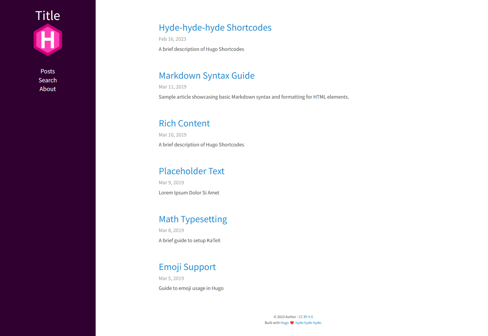

# hyde-hyde-hyde

__`hyde-hyde-hyde`__ is a [Hugo](https://gohugo.io)'s theme inspired and derived from htr3n [hyde-hyde](https://github.com/htr3n/hyde-hyde)

## Changes

- Remove font awesome
- Remove Portfolio
- Use local fonts
- Remove social from sidebar
- Move copyright to bottom
- Remove comments
- Added search

TODO:
MermaidJS
Fix Note/Warning/Error notes
Fix code sections (copy button?)
Page views without google

## Usage

### Installation

__`hyde-hyde-hyde`__ can be easily installed as many other Hugo themes:

```sh
$ cd HUGO_PROJECT

# then either clone hyde-hyde-hyde
$ git clone https://github.com/gamingrobot/hyde-hyde-hyde.git themes/hyde-hyde-hyde

# or just add hyde-hyde-hyde as a submodule
$ git submodule add https://github.com/gamingrobot/hyde-hyde-hyde.git themes/hyde-hyde-hyde
```

After that, choose `hyde-hyde-hyde` as the main theme.

* `config.toml` 

```toml
theme = "hyde-hyde-hyde"
```

* `config.yaml`

```yaml
theme : "hyde-hyde-hyde"
```

That's all. You can render your site using `hugo` and see `hyde-hyde-hyde` in action.

### Options

__`hyde-hyde-hyde`__ essentially inherits most of Hyde's [options](https://github.com/spf13/hyde#options). There are some extra options though

* `highlightjs = true`: use [highlight.js](https://highlightjs.org) instead of Hugo built-in support for code highlighting

  * `highlightjsstyle="highlight-style"`: only when `highlightjs = true`, please choose one of many _highlight.js_'s [styles](https://highlightjs.org/static/demo).
    * `highlight = false`  (default `true`)
    * `highlightjslanguages = ["swift", "objectivec"]` 

* `postNavigation = true|false` (default `true`): Setting to `false` will disable the navigation _Previous Post_/ _Next Post_

* `relatedPosts = false|true` (default `false`): Setting to `true` allows related posts. Please refer [here](https://gohugo.io/content-management/related) for more details on related contents with Hugo.

*  `include_toc = false`: Setting to `false` in FrontMatter will disable too short TOC data as your want. 

### Customizations

* Most of the customizable SCSS styles in [_assets/scss/hyde-hyde_](assets/scss/hyde-hyde) and Hugo templates in [_hyde-hyde/layouts_](layouts) are modularized and can be altered/adapted easily.

### Posts in home page
By default hugo will show in your home page the most populated section.
This means that if you have more projects than posts, by default your home page will list your projects instead of your posts.
If you want to change this behaviour you can change the [mainsections](https://gohugo.io/functions/where/#mainsections).
For example, for the [exampleSite](https://github.com/htr3n/hyde-hyde-hyde/tree/master/exampleSite) this is how you should change the `config.toml` file:
```
[params]
    mainSections = ["posts"]
```

## Some Screenshots

### Main page



### A post


### Portfolio


### Mobile Mode with Collapsible Menu


## Author(s)

* Hyde-Hyde by [htr3n](https://github.com/htr3n)

* Original developed by [Mark Otto](https://github.com/mdo)

* Hugo's `hyde` ported by [Steve Francia](https://github.com/spf13)

## License

Open sourced under the [MIT license](LICENSE.md)
